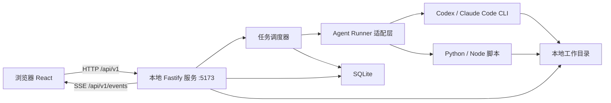
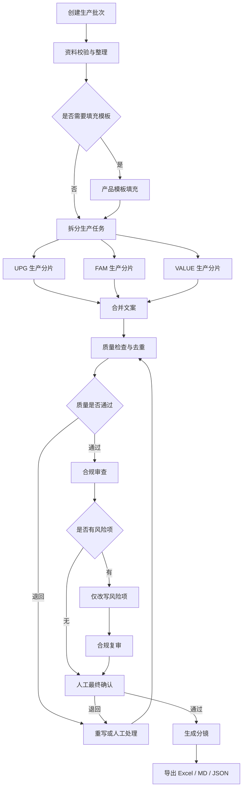
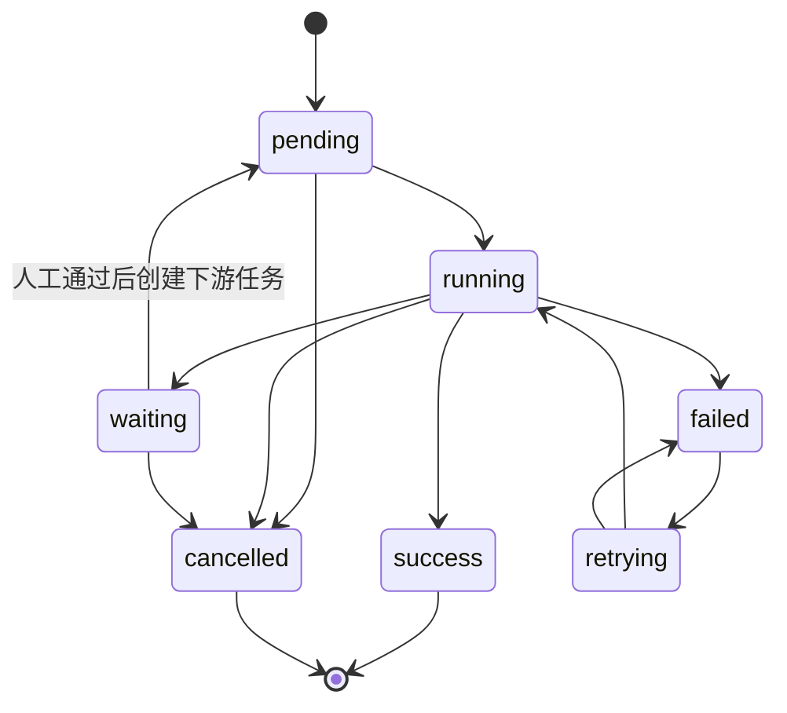

# 内容批量生产工作流网页化与本地单端口调度方案

日期：2026-07-10

## 0. 当前落地状态

截至 2026-07-10，本方案的 MVP 基础链路已落地：

- UI 与本机 API 共用一个自动选择的 `127.0.0.1:5173+` 端口。
- 已启用本地 SQLite，保存同步、上传和任务历史。
- 已扫描 `E:\Github\.claude\agents`，12/12 个内容 Agent 就绪。
- `content_generate`、`script_generate`、`quality_check` 会写入 `local-data/workflow-inbox`。
- 已提供 `POST /api/workflows/douyin-ecom-copy/run` 专用调度端口。
- 页面重载后会从本地任务历史恢复任务。

本次实际使用 Node 原生 HTTP + Vite middleware 和 `node:sqlite`，没有引入 Fastify/Zod；这是为了保持 MVP 依赖轻量。Claude Code worker 自动启动、SSE 日志和产物回写仍按本文后续阶段实施。

## 1. 方案结论

将现有文案生产 Agent 工作流迁移到 `ecom-ai-studio`，采用“一个本地服务、一个浏览器端口、一个统一任务队列”的架构：

- 用户只访问服务启动时输出的 `http://127.0.0.1:5173+` 地址。
- React 页面、REST API、SSE 进度事件、产物下载均通过同一端口提供。
- 本地服务负责读取文件、创建任务、调度 Agent、运行 Python/Node 脚本、记录日志和管理产物。
- Agent 与脚本通过子进程标准输入输出通信，不额外开放网络端口。
- 浏览器不直接执行系统命令，不直接读取任意本地路径，不保存模型密钥。
- 第一阶段只迁移内容生产链路，不接真实店铺、广告平台或抓取账号。

推荐技术栈：

| 层级 | 选型 | 说明 |
|---|---|---|
| 网页 | React + TypeScript + Vite + TailwindCSS | 复用当前 MVP |
| 本地服务 | Fastify + TypeScript | 同时承载页面、API、SSE、上传和下载 |
| 数据持久化 | SQLite + Repository 层 | 保存批次、任务、日志索引、审批和产物元数据 |
| 本地执行 | `node:child_process.spawn` | 调用 Codex/Claude Code 适配器及现有 Python 脚本 |
| 实时进度 | Server-Sent Events | 单向推送任务状态，足够轻量且支持自动重连 |
| 文件产物 | 本地工作目录 | Excel、Markdown、JSON、日志和分镜文件仍保留在本机 |
| 校验 | Zod | 前后端共享请求、响应和任务配置类型 |

## 2. 目标与边界

### 2.1 目标

1. 在网页中完成批次创建、参数选择、执行、审核、重试和导出。
2. 迁移现有 UPG、FAM、VALUE 三类文案并发生产流程。
3. 保留资料整理、模板填充、质量去重、合规审查、合规改写、复审和分镜生成的工序边界。
4. 页面关闭或本地服务重启后，任务记录和产物仍然存在。
5. 所有任务进入统一任务队列，首页、内容生产页和任务队列看到相同状态。
6. Agent 或脚本失败时可以定位到具体批次、任务、输入、错误日志和输出文件。

### 2.2 第一阶段不做

- 不登录真实抖音、千川、淘宝、天猫或其他店铺账号。
- 不做真实投放、发布、竞品抓取或反爬绕过。
- 不把服务监听到局域网或公网。
- 不允许网页提交任意命令行字符串。
- 不允许 Agent 自动写入长期资料库；资料库写入必须人工确认。
- 不在浏览器 LocalStorage、日志或 SQLite 明文保存 API 密钥。

## 3. 总体架构



### 3.1 单端口原则

统一监听 `127.0.0.1:5173`：

- `/`：React 应用。
- `/assets/*`：前端静态资源。
- `/api/v1/*`：业务 API。
- `/api/v1/events`：SSE 实时状态。
- `/api/v1/artifacts/:artifactId/download`：受控产物下载。
- `/health`：本机健康检查。

开发环境由 Fastify 挂载 Vite middleware；生产环境由 Fastify 直接提供 `dist/`。这样开发和打包后都只有一个浏览器入口，不使用“前端 5173 + 后端 3000”的双端口结构。

### 3.2 进程边界

本地应用包含一个主进程和若干按需子进程：

- 主进程：HTTP、SSE、任务调度、SQLite、文件索引。
- Agent 子进程：按任务调用 Codex 或 Claude Code，执行结束即退出。
- 工具子进程：调用现有 Python 脚本生成 Excel、转换 Office 文档或构建产物。
- 子进程不监听端口，只通过 stdin、stdout、stderr、退出码和产物清单与主进程通信。

## 4. 现有工作流迁移映射

### 4.1 生产主链路



### 4.2 Agent 与任务类型映射

| 工序 | 现有 Agent | 新任务类型 | 是否可并发 |
|---|---|---|---|
| 资料整理 | `home-material-intake` | `material_intake` | 按商品并发，默认 2 |
| 模板填充 | `product-template-filler` | `template_fill` | 单模板串行 |
| UPG 文案 | `mattress-upgrade-copy-producer` | `content_generate` | 可按 10 条分片 |
| FAM 文案 | `mattress-family-pain-copy-producer` | `content_generate` | 可按 10 条分片 |
| VALUE 文案 | `mattress-config-value-copy-producer` | `content_generate` | 可按 10 条分片 |
| 质量去重 | `copy-quality-deduper` | `quality_check` | 批次合并后单任务 |
| 合规审查 | `douyin-copy-compliance-reviewer` | `compliance_review` | 可分片，最终合并 |
| 合规改写 | `compliance-rewrite-producer` | `compliance_rewrite` | 只处理风险项 |
| 合规复审 | `douyin-copy-compliance-reviewer` | `compliance_review` | 只复审改写项 |
| 分镜脚本 | `douyin-storyboard-script-writer` | `script_generate` | 按文案分片 |
| 导出结果 | 现有 Excel/文件脚本 | `export_package` | 每批次一个任务 |

现有网页中的 `content_generate`、`script_generate`、`quality_check`、`export_package` 可以直接保留；类型定义需增加 `material_intake`、`template_fill`、`compliance_review`、`compliance_rewrite`。

### 4.3 批量拆分规则

- 每个生产任务默认最多生成 10 条文案。
- UPG、FAM、VALUE 彼此并行，同类型按序号范围继续拆分。
- 示例：UPG 25 条拆成 `001-010`、`011-020`、`021-025` 三个任务。
- 每个分片必须带不同的目标人群、主卖点或内容侧重，降低同质化。
- 全部分片成功后才创建批次级质量检查任务。
- 单个分片失败不丢弃其他成功分片；允许只重试失败分片。
- 合规改写只接收 `需修改` 和 `待确认` 项，不重写整批内容。

## 5. 网页操作设计

### 5.1 内容生产页改造

页面分为四个区域：

1. 批次列表：状态、商品、数量、平台、创建时间、当前工序和负责人。
2. 批次创建向导：选择商品资料、目标平台、文案类型、数量、模型档位和是否生成分镜。
3. 运行工作台：展示 DAG 工序、并发任务、耗时、失败和待确认数量。
4. 结果审核区：逐条查看文案、质量问题、合规标注、改写结果和分镜。

批次创建字段：

| 字段 | 示例 | 规则 |
|---|---|---|
| 批次名称 | 豆芽 Hit 直播引流文案 2026-07-10 | 必填 |
| 商品/SKU | 豆芽Hit护脊款 / M5301003 | 必填 |
| 资料来源 | 已填充 Excel、Word、粘贴文本 | 至少一种 |
| 平台 | 抖音、视频号、小红书 | 第一阶段默认抖音 |
| 文案类型 | UPG、FAM、VALUE | 可多选 |
| 每类数量 | 10 | 1-100 |
| 目标人群 | P-FAM、P-PET 等 | 可多选 |
| 模型档位 | 日常 / 首轮重点 / 自定义 | 只保存策略，不暴露密钥 |
| 自动分镜 | 开/关 | 默认开启 |
| 人工确认点 | 合规后、导出前 | 默认全部开启 |

### 5.2 批次详情页

批次详情展示：

- 顶部：总体状态、总进度、成功数、失败数、待确认数、累计耗时。
- 左侧：工序时间线与依赖关系。
- 中部：当前工序任务列表和实时日志摘要。
- 右侧：输入文件、输出文件、失败原因和操作按钮。
- 下方：文案表格、合规对照、分镜表格和版本历史。

操作权限由任务状态决定：

| 状态 | 可执行操作 |
|---|---|
| `pending` | 取消、调整优先级 |
| `running` | 查看日志、取消 |
| `waiting` | 人工确认、退回修改、补充资料 |
| `failed` | 查看错误、重试、跳过非必要任务 |
| `retrying` | 查看重试次数、取消 |
| `success` | 查看产物、创建下游任务、导出 |
| `cancelled` | 复制为新任务 |

### 5.3 人工审核

人工确认不能只做一个“通过”按钮，需要记录：

- 审核对象：批次、文案或资料库候选项。
- 审核动作：通过、退回、标记待确认、采用改写、保留原文。
- 审核备注。
- 审核前后版本。
- 操作时间和本地操作人名称。

长期资料库写入单独设置确认步骤，默认不会随批次自动执行。

## 6. 任务调度设计

### 6.1 状态机



任务状态继续沿用当前网页定义：`pending`、`running`、`success`、`failed`、`waiting`、`retrying`、`cancelled`。

### 6.2 调度器职责

- 从 SQLite 原子领取 `pending` 任务，避免重复执行。
- 检查前置依赖，只有依赖全部成功才能运行。
- 按资源组限制并发。
- 每 5 秒更新任务心跳、进度和运行时间。
- 捕获 stdout/stderr，写入 NDJSON 日志文件并推送摘要事件。
- 根据退出码、结果清单和必需产物判断成功，不能只看进程退出码。
- 支持取消、超时、有限次数重试和指数退避。
- 服务重启时，将失去心跳的 `running` 任务恢复为 `retrying`，并保留上次尝试日志。

### 6.3 默认并发

| 资源组 | 默认并发 | 原因 |
|---|---:|---|
| LLM 文案生产 | 3 | 对应 UPG/FAM/VALUE 三路并行 |
| LLM 审核/分析 | 2 | 控制成本和上下文冲突 |
| 分镜生成 | 3 | 可按文案分片 |
| Office/Python 文件任务 | 2 | 避免同时写同一工作簿 |
| 模板写入 | 1 | 同一模板禁止并发写 |
| 资料库写入 | 1 | 必须人工确认且串行 |

并发数在系统设置页配置，修改只影响新领取任务。

### 6.4 幂等和重试

每个任务生成 `idempotency_key`：

```text
workflow_id + batch_id + step_id + shard_index + input_hash + config_hash
```

- 同一个幂等键已有成功任务时，默认复用产物。
- 用户选择“强制重新生成”时创建新 revision，不覆盖旧产物。
- 自动重试仅用于进程异常、临时网络错误和超时。
- 输入缺失、字段校验失败、合规待确认不自动重试，转为 `waiting`。
- 默认最多重试 2 次，间隔 5 秒、20 秒。

## 7. 本地 Agent Runner

### 7.1 统一适配器接口

```ts
interface RunnerAdapter {
  preflight(): Promise<RunnerHealth>;
  run(input: RunRequest, signal: AbortSignal): AsyncIterable<RunnerEvent>;
  cancel(runId: string): Promise<void>;
}
```

Runner 只接收结构化参数：

- `agentId`
- `promptFile`
- `inputFiles`
- `outputDirectory`
- `modelProfile`
- `timeoutSeconds`
- `environmentAllowlist`

不接收网页传来的任意 shell 命令。

### 7.2 适配器类型

1. `mock-runner`：用于网页开发和 E2E 测试，固定输出可复现结果。
2. `codex-runner`：读取 Codex 兼容提示词，通过本机 Codex CLI 执行。
3. `claude-code-runner`：按 `.claude/agents/*.md` 的 Agent ID 执行。
4. `script-runner`：只允许调用注册表中的 Python/Node 脚本。

CLI 参数可能随版本变化，因此启动时必须运行 `preflight`，检测：

- 可执行文件是否存在。
- 当前版本。
- 是否已登录或具备可用凭据。
- 指定 Agent/模型是否可用。
- 输出格式是否符合适配器解析器。

CLI 命令模板存放在服务端配置中，网页只选择 `runnerId` 和 `modelProfile`。

### 7.3 脚本注册表

第一批接入现有脚本：

| 脚本 ID | 文件 | 用途 |
|---|---|---|
| `fill-product-template` | `E:\Github\scripts\fill_template_dou7pro.py` | 填充产品模板 |
| `convert-office-to-md` | `E:\Github\scripts\convert-office-to-md.py` | Office 资料标准化 |
| `build-copy-excel` | `E:\Github\scripts\build_copy_excel.py` | 构建文案 Excel |

注册表需要声明固定可执行文件、参数 Schema、允许的输入目录、输出目录和超时。执行时使用 `spawn(executable, args, { shell: false })`。

## 8. 数据模型

建议使用以下 SQLite 表：

| 表 | 核心字段 | 用途 |
|---|---|---|
| `workflows` | id, name, version, definition_json | 保存工作流版本 |
| `batches` | id, workflow_id, name, status, config_json | 生产批次 |
| `jobs` | id, batch_id, type, status, progress, dependency_json | 队列任务 |
| `job_attempts` | id, job_id, attempt, pid, started_at, ended_at | 每次运行尝试 |
| `job_events` | id, job_id, sequence, level, event_json | 结构化事件 |
| `artifacts` | id, job_id, kind, path, hash, size, revision | 输入和输出产物 |
| `content_items` | id, batch_id, copy_code, type, payload_json, version | 文案结果 |
| `reviews` | id, target_type, target_id, action, comment, snapshot_json | 人工审核 |
| `settings` | key, value_json, updated_at | 非敏感本地配置 |

索引至少包括：

- `jobs(status, priority, created_at)`
- `jobs(batch_id, type)`
- `job_events(job_id, sequence)`
- `artifacts(job_id, kind)`
- `content_items(batch_id, copy_code, version)`

密钥不进入 `settings` 表。第一阶段使用 Windows 用户级环境变量；后续可接 Windows Credential Manager。

## 9. 文件目录规范

```text
E:\Github\ecom-ai-studio\local-data\
├── studio.db
├── logs\
│   └── YYYY-MM-DD\{job-id}.ndjson
├── batches\
│   └── {batch-id}\
│       ├── input\
│       ├── normalized\
│       ├── work\
│       ├── output\
│       └── manifest.json
├── temp\
└── backups\
```

最终业务产物仍可同步复制到：

```text
E:\Github\文案量产项目\输出\YYYY-MM-DD\
├── 文案生产\
├── 合规审查\
└── 分镜脚本\
```

规则：

- 文件路径由服务端生成，不信任浏览器传入的绝对路径。
- 输入文件复制到批次目录后再执行，避免原文件运行中被修改。
- 产物文件采用 revision，不覆盖历史版本。
- `manifest.json` 保存输入哈希、任务版本、Agent ID、配置和产物清单。
- `local-data/`、日志和临时文件必须加入 `.gitignore`。

## 10. API 设计

统一前缀：`/api/v1`。

### 10.1 批次

| 方法 | 路径 | 用途 |
|---|---|---|
| `GET` | `/batches` | 分页查询批次 |
| `POST` | `/batches` | 创建批次，返回 201 |
| `GET` | `/batches/:batchId` | 批次详情 |
| `POST` | `/batches/:batchId/start` | 启动批次 |
| `POST` | `/batches/:batchId/cancel` | 取消未结束任务 |
| `POST` | `/batches/:batchId/export` | 创建导出任务 |

### 10.2 任务

| 方法 | 路径 | 用途 |
|---|---|---|
| `GET` | `/jobs` | 按批次、类型、状态筛选 |
| `GET` | `/jobs/:jobId` | 任务详情 |
| `GET` | `/jobs/:jobId/events` | 分页读取历史事件 |
| `POST` | `/jobs/:jobId/retry` | 创建重试 attempt |
| `POST` | `/jobs/:jobId/cancel` | 取消任务 |
| `POST` | `/jobs/:jobId/confirm` | 完成人工确认 |

### 10.3 结果与产物

| 方法 | 路径 | 用途 |
|---|---|---|
| `GET` | `/batches/:batchId/content-items` | 查询文案结果 |
| `PATCH` | `/content-items/:itemId` | 人工编辑并创建新版本 |
| `POST` | `/content-items/:itemId/review` | 审核单条文案 |
| `GET` | `/artifacts/:artifactId` | 产物元数据 |
| `GET` | `/artifacts/:artifactId/download` | 下载文件 |

### 10.4 系统

| 方法 | 路径 | 用途 |
|---|---|---|
| `GET` | `/system/health` | Node、SQLite、目录和 Runner 状态 |
| `GET` | `/system/runners` | Runner 预检结果 |
| `GET` | `/system/settings` | 非敏感配置 |
| `PATCH` | `/system/settings` | 更新并发、目录和默认策略 |
| `GET` | `/events` | SSE 实时事件流 |

成功响应统一为 `{ "data": ... }`；错误响应统一为：

```json
{
  "error": {
    "code": "input_file_missing",
    "message": "批次输入文件不存在",
    "details": [
      { "field": "inputArtifactId", "message": "未找到对应产物" }
    ]
  }
}
```

常用状态码：创建 `201`、校验失败 `422`、状态冲突 `409`、不存在 `404`、任务执行异常 `500`、Runner 暂不可用 `503`。

## 11. SSE 实时事件

事件结构：

```json
{
  "id": "evt_01",
  "type": "job.progress",
  "occurredAt": "2026-07-10T10:30:00+08:00",
  "batchId": "batch_01",
  "jobId": "job_08",
  "data": {
    "status": "running",
    "progress": 65,
    "message": "已完成 13/20 条合规审查"
  }
}
```

事件类型至少包括：

- `batch.updated`
- `job.created`
- `job.started`
- `job.progress`
- `job.log`
- `job.waiting`
- `job.failed`
- `job.completed`
- `artifact.created`
- `review.required`

浏览器断线重连时携带 `Last-Event-ID`；服务端从 `job_events` 补发缺失事件，然后继续实时推送。

## 12. 安全与本机权限

1. 仅绑定 `127.0.0.1`，禁止默认监听 `0.0.0.0`。
2. 检查 `Origin` 和 `Host`，只允许本机应用来源。
3. 启动时生成本地会话令牌，使用 HttpOnly SameSite Cookie。
4. 所有上传文件检查扩展名、MIME、大小和文件头。
5. 所有可读写路径必须位于配置的工作目录白名单内。
6. 子进程一律 `shell: false`，参数必须经过 Zod Schema 校验。
7. 网页不得提交 executable、cwd、environment 或任意命令字符串。
8. 日志对 Token、Authorization、Cookie 和环境变量进行脱敏。
9. 文件下载根据 artifactId 查库，不允许路径参数直接下载。
10. 资料库写入、模板覆盖和最终导出前保留人工确认。

## 13. 前端工程改造

建议新增：

```text
src/
├── api/
│   ├── client.ts
│   ├── batches.ts
│   ├── jobs.ts
│   ├── artifacts.ts
│   └── events.ts
├── hooks/
│   ├── useBatches.ts
│   ├── useBatchDetail.ts
│   └── useTaskEvents.ts
├── features/content-workflow/
│   ├── BatchCreateWizard.tsx
│   ├── WorkflowGraph.tsx
│   ├── BatchRunPanel.tsx
│   ├── ContentReviewTable.tsx
│   ├── ComplianceCompare.tsx
│   └── StoryboardTable.tsx
└── types/api.ts
```

改造原则：

- `App.tsx` 不再直接保存全局任务真相，改为从 API 查询。
- Mock 与真实接口使用相同 DTO；通过 `VITE_DATA_MODE=mock|local` 切换。
- 列表分页和过滤交给服务端，避免大批次撑爆浏览器。
- 表格保留横向滚动；超过 300 条时启用虚拟列表。
- SSE 只更新受影响任务，不重复刷新全部批次。
- 所有表单提交有 loading、失败原因和可重试状态。
- 页面刷新后从 API 恢复批次状态，而不是回到初始 Mock。

## 14. 后端目录建议

```text
server/
├── index.ts
├── app.ts
├── config/
├── api/
│   ├── batches.routes.ts
│   ├── jobs.routes.ts
│   ├── artifacts.routes.ts
│   └── system.routes.ts
├── domain/
│   ├── workflow/
│   ├── job/
│   └── artifact/
├── services/
│   ├── workflow.service.ts
│   ├── scheduler.service.ts
│   ├── runner.service.ts
│   └── artifact.service.ts
├── runners/
│   ├── mock.runner.ts
│   ├── codex.runner.ts
│   ├── claude-code.runner.ts
│   └── script.runner.ts
├── repositories/
│   ├── batch.repository.ts
│   ├── job.repository.ts
│   └── artifact.repository.ts
├── db/
│   ├── migrations/
│   └── connection.ts
└── shared/
    ├── errors.ts
    ├── logger.ts
    └── schemas.ts
```

Controller 只做 HTTP 解析与响应，Service 负责业务规则，Repository 负责 SQLite，Runner 负责外部进程。这样以后替换 Agent CLI、数据库或文件脚本时，不需要重写网页。

## 15. 启动与部署

建议增加脚本：

```json
{
  "scripts": {
    "dev": "tsx server/index.ts --dev",
    "build": "tsc --noEmit && vite build && tsup server/index.ts --format esm --out-dir dist-server",
    "start": "node dist-server/index.js",
    "test": "vitest run",
    "test:e2e": "playwright test"
  }
}
```

启动行为：

1. 校验 Node、Python、工作目录和 SQLite。
2. 执行数据库迁移。
3. 预检 Runner 和已注册脚本。
4. 恢复中断任务。
5. 监听 `127.0.0.1:5173`。
6. 输出唯一访问地址和环境状态。

后续可增加 Windows 启动脚本或桌面快捷方式，但不需要立即改成 Electron。

## 16. 分阶段实施

### 阶段 A：单端口服务骨架，2-3 个开发日

- 建立 Fastify 服务与 Vite middleware。
- 建立 `/health`、API 错误格式和 SSE 通道。
- 前端从 Mock 模式切换到本地 API 模式。
- 保持现有 UI 不变。

验收：一个命令启动，一个端口打开网页和 API。

### 阶段 B：SQLite 与统一任务队列，3-4 个开发日

- 创建数据库迁移和 Repository。
- 实现任务状态机、依赖、并发、取消、重试和恢复。
- 将现有任务队列页改接真实本地数据。
- 日志和产物元数据持久化。

验收：服务重启后任务仍在，失败任务可以单独重试。

### 阶段 C：内容工作流 Runner，4-6 个开发日

- 接入 mock、Agent CLI 和脚本 Runner。
- 迁移资料整理、三类文案生产、质量去重和合规流程。
- 接入现有 Excel 构建脚本。
- 实现分片合并、幂等和产物清单。

验收：网页创建 30 条任务，UPG/FAM/VALUE 并行完成并生成结构化结果。

### 阶段 D：人工确认与分镜导出，3-4 个开发日

- 增加逐条审核、退回、改写、复审和版本记录。
- 接入分镜生成。
- 导出 Excel、Markdown、JSON 和批次压缩包。
- 资料库写入增加独立确认。

验收：从商品资料到最终文案和分镜，全程可在网页完成。

### 阶段 E：验证与本机交付，2-3 个开发日

- 单元测试任务状态机、依赖和幂等。
- 集成测试 Runner 超时、失败、取消和重启恢复。
- Playwright 测试创建批次、审核、重试和下载产物。
- 验证 1440、1920 屏幕和长表格。
- 补充安装、备份和故障排查文档。

预计总量：14-20 个开发日。若第一版只接 Mock Runner 和一个真实文案 Runner，可压缩到 7-10 个开发日。

## 17. 测试策略

### 单元测试

- 状态迁移是否合法。
- 批量分片数量和序号是否正确。
- 依赖任务是否正确解锁。
- 幂等键是否稳定。
- 路径白名单是否阻止越界。
- 合规改写是否只接收风险项。

### 集成测试

- Runner 成功、失败、超时和取消。
- SQLite 事务领取任务避免重复执行。
- 服务重启恢复任务。
- SSE 断线重连补发事件。
- Excel/Markdown/JSON 产物生成和下载。

### E2E 测试

1. 创建 UPG/FAM/VALUE 各 10 条的批次。
2. 观察三路任务并行。
3. 制造一个分片失败并单独重试。
4. 在合规阶段退回一条文案。
5. 采用改写并完成复审。
6. 人工确认后生成分镜。
7. 导出并验证产物清单。
8. 刷新页面和重启服务后确认状态恢复。

## 18. 验收标准

- `npm run dev` 后只需访问 `http://127.0.0.1:5173/`。
- UI、API、SSE 和下载不依赖第二个浏览器可见端口。
- 可以在网页创建真实本地批次并选择 UPG、FAM、VALUE 数量。
- 三类文案按配置并行，超过 10 条自动拆分。
- 质量检查、合规、改写、复审、人工确认和分镜依赖正确。
- 任务状态、进度、日志、失败原因和产物实时显示。
- 任意失败分片可单独重试，不重复执行成功分片。
- 服务重启后批次、任务、审核和产物记录不丢失。
- 最终可导出 Excel、Markdown、JSON 和批次压缩包。
- 网页无法执行未注册命令或访问白名单外路径。
- API 密钥不出现在浏览器、SQLite、日志和导出文件中。

## 19. 主要风险与应对

| 风险 | 影响 | 应对 |
|---|---|---|
| Agent CLI 参数或输出格式变化 | Runner 解析失败 | 适配器隔离、启动预检、版本记录、契约测试 |
| 长任务页面断线 | 用户误以为任务停止 | 后端独立运行、SSE 重连、状态持久化 |
| 多任务写同一 Excel | 文件损坏 | 模板/导出资源组串行、临时文件原子替换 |
| 文案分片同质化 | 产出质量下降 | 分片绑定人群/卖点/序号范围，统一去重 |
| 合规改写引入新事实 | 风险扩大 | 只允许基于原文改写，复审必经，人工确认 |
| 子进程失控 | CPU/GPU/费用占用 | 并发限制、超时、心跳、取消和最大重试 |
| 本地文件被覆盖 | 难以回滚 | 输入复制、产物 revision、哈希和 manifest |
| 项目目录被 Git 忽略 | 代码无法形成版本基线 | 开发前调整父级 `.gitignore` 并单独确认提交范围 |

## 20. 推荐实施顺序

第一轮只打通一条最短可用闭环：

```text
网页创建批次
  -> SQLite 任务队列
  -> UPG/FAM/VALUE Mock Runner
  -> 质量检查 Mock
  -> 人工确认
  -> 分镜 Mock
  -> Excel 导出
```

闭环稳定后，再把每个 Mock Runner 逐个替换为真实本地 Agent 或脚本。前端、任务协议和数据表不随 Runner 替换而改变，能够显著降低一次性迁移风险。

最终目标不是让网页“远程操控命令行”，而是把现有 Agent 流程变成有状态、可恢复、可审核、可追踪的本地生产系统。
