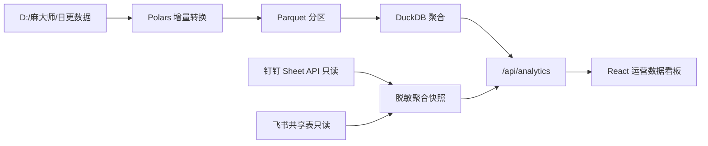

# 运营数据本地化方案

日期：2026-07-12
状态：✅ 已实施（本文档即当前架构说明）
最后核验：2026-07-20 — `scripts/extract-power-query.mjs`、`pipeline/ecom_pipeline/{readers,transforms,warehouse}.py`、`local-data/warehouse/{analytics-snapshot.json,ecom.duckdb,marts/,staging/}`、`scripts/sync-dingtalk.mjs`、前端 `AnalyticsPage.tsx` 均已落地。

## 结论

运营页面不再调用 Power BI Desktop 或其动态 Analysis Services 端口。`麻大师店铺推广数据报表.pbix` 中的 M 查询已作为迁移依据导出，实际网页数据由本机文件数仓、钉钉共享表和飞书共享表提供，并始终通过同一个本机端口读取聚合快照。



## 当前实现

| 数据源 | 实现 | 调度 | 浏览器暴露范围 |
|---|---|---|---|
| 本地经营文件 | Python、Polars、Parquet、DuckDB | 网页手动同步或 `python pipeline/sync.py sync` | 聚合 KPI、趋势、平台和数据质量 |
| 钉钉共享表 | Sheet API，只读，重试与串行读取 | 每日 10:30、13:00、17:30 | 脱敏经营聚合、工作表数量和同步时间 |
| 飞书共享表 | 本机用户身份只读聚合 | 网页手动同步 | 内容平台、日期与效果聚合 |

## 本地数仓迁移

1. `scripts/extract-power-query.mjs` 从 TMDL 中提取 25 个 M 查询，写入 `migration/power-query-m/original/`。
2. `migration/power-query-m/manifest.json` 记录查询、源路径、字段类型和转换特征。
3. `pipeline/ecom_pipeline/readers.py` 读取 XLSX、XLS、CSV 和 HTML 导出的 XLS。
4. `pipeline/ecom_pipeline/transforms.py` 执行可复用的类型标准化、日期与数值清洗。
5. `pipeline/ecom_pipeline/warehouse.py` 按源文件哈希写入 Parquet 分区，构建 DuckDB 表和聚合 mart。
6. `local-data/warehouse/analytics-snapshot.json` 是网页唯一读取的本地经营文件快照。

每次同步只重算新增或修改的文件。原始业务文件、DuckDB、Parquet 分区和状态文件均在 `local-data/`，不写入 Git。

## 数据口径和优先级

1. 某一 KPI 只选一个当前权威来源，不将跨来源重复指标直接相加。
2. 当前经营总览优先使用钉钉当期共享表；本地数仓提供文件级历史、趋势和质量状态；飞书提供内容效果聚合。
3. 网页展示来源标识、刷新时间、数据周期和异常数，避免把不同刷新周期的数据伪装为同一实时口径。
4. 本地数仓当期缺失的消耗字段不被推断为零值；看板保留来源说明。
5. 素材 TOP10 与胜率在缺少 `MaterialId <-> ContentId` 映射时标为待接入，不伪造为真实归因。

## 安全边界

- 浏览器不直接调用钉钉、飞书或本地数据库。
- Token 只从本机环境变量读取，日志和 API 返回中只显示连接状态。
- 网页只读取聚合快照；客户服务、手机号、买家、负责人和原始链接不出本机数据层。
- 钉钉和飞书均为只读接入，不创建、不修改、不删除外部数据。
- 本期不接入真实店铺账号、投放写操作或第三方平台抓取。

## 运行与监控

```bash
python pipeline/sync.py sync
npm run sync:dingtalk
npm run schedule:dingtalk
```

- `/api/data-sources` 返回数仓、钉钉、飞书和工作流的连接状态。
- `/api/analytics` 返回三类来源的最新聚合快照。
- `/api/sync/warehouse`、`/api/sync/dingtalk`、`/api/sync/feishu` 触发一次受控同步。
- 同步历史进入本机 SQLite，运行失败会在运营页和系统设置中显示。

## 后续接入点

1. 补齐统一 SKU、店铺、活动和素材主键映射。
2. 将本地图片处理结果写入图片处理任务产物目录。
3. 导入合规的竞品与 TOP100 结果文件，接入任务队列。
4. 为内容生成 worker 增加受控启动、日志流和产物回写。
